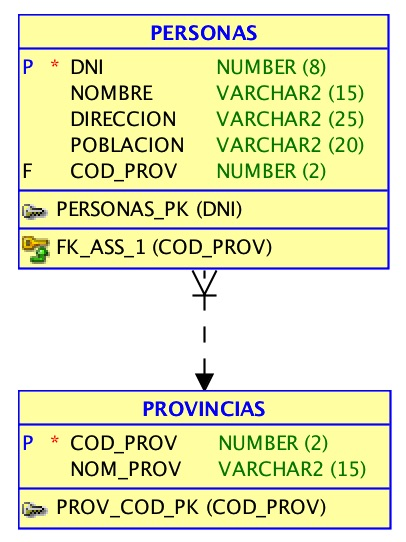

# Ejercicio 4 - Crear tablas Personas y Provincias

Crea un script SQL que contenga lo necesario para la creación de las tablas Personas y Provincias.

Para crear las tablas utiliza el siguiente esquema relacional.

Una vez creadas, añade al final de tu script SQL, las consultas necesarias para  visualizar las restricciones definidas para las tablas PROVINCIAS y PERSONAS.

